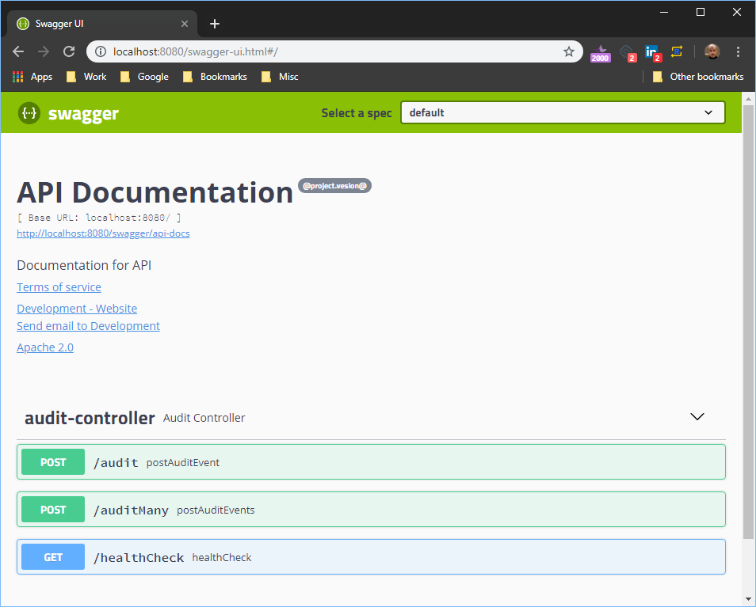

# draiver-build-parent_microservice-maven

## Introduction
This pom file is the parent pom for all Draiver microservices. This pom defines all the common dependenices and build goals needed to create the microservice. 

## Getting Started
Make sure your .m2/settings.xml contains the Draiver repositories. If you don't have them in your settings.xml file you won't be able to compile any project that uses this parent pom. You can find a copy of settings.xml in [draiver-build-utility-misc](https://github.com/DriverDo/draiver-build-utility-misc)

```xml
<settings xmlns="http://maven.apache.org/SETTINGS/1.0.0"
	xmlns:xsi="http://www.w3.org/2001/XMLSchema-instance"
	xsi:schemaLocation="http://maven.apache.org/SETTINGS/1.0.0
                      https://maven.apache.org/xsd/settings-1.0.0.xsd">

	<profiles>
		<profile>

			<repositories>
				<repository>
					<id>internal.repo</id>
					<name>Draiver Internal Repository</name>
					<url>http://nexus.draiver.net/repository/maven-releases/</url>
				</repository>
				<repository>
					<id>snapshot.repo</id>
					<name>Draiver snapshot</name>
					<url>http://nexus.draiver.net/repository/maven-snapshots/</url>
				</repository>
			</repositories>
			
		</profile>
	</profiles>

</settings>
```

## Maven Commands


|Description|Command|
|---|---|
|Find out of date dependencies|mvn versions:display-dependency-updates|
|Sort contents of pom file|mvn sortpom:sort|
|Scan for bugs|mvn spotbugs:spotbugs (creates xml file)<br/>mvn spotbugs:check<br/>mvn checkstyle:check<br/>mvn checkstyle:checkstyle (creates xml file)|
|Run springboot app|mvn spring-boot:run|
|Deploy artifact to Nexus|mvn clean install deploy|
|Build without tests|mvn clean install -P noTests|

<br/>

## AWS
You can deploy your microservice to AWS ElasticBeanstalk using the following maven command

```bash
mvn clean install -P envDEV,beanstalk-deploy
```
The above example will deploy the microservice to the DEV beanstalk environment. You can deploy to:

|Command|Environment|
|---|---|
|envDEV|Development|
|envQA|QA|
|envSTAGING|Staging|
|envPROD|Production|

<br/>

**NOTE**: to be able to use the AWS commands you need the AWS CLI installed, and you must have the following profiles in your .aws/credentials file.

|Name|
|---|
|shared|
|nonprod|
|prod|

<br/>

You can get a copy of the .aws files by going to [draiver-build-utility-misc](https://github.com/DriverDo/draiver-build-utility-misc)


## Consul
If you want your REST controler to suppport [Consul](https://www.consul.io/) for service registry and distrubuted configuration all you need to do is make sure your REST controller extends *ConsulAwareControler* the rest is taken care of behind the scenes. To learn more about supporting Consl review [consul-setup.md](docs/consul-setup.md).

## Audit Telemetry
All microservices that are built using this parent pom will have the ability to send audit information. Please review the [Audit Library Documentation](https://github.com/driverdo/draiver-utility-audit_api-java/blob/master/docs/readme.md) for more informaiton. 

To support auditing all you need to do is make sure you have an **auditor.xml** file located at **src/main/resources**.

**Suggested auditor.xml File**

```xml
<?xml version="1.0" encoding="ISO-8859-1" ?>
<configuration>

	<auditors>
		<auditor declaringTypeRegEx=".*" class="com.draiver.core.utility.audit.auditor.StandardAuditor" />
	</auditors>

	<appenders>

		<appender name="LoggerAuditAppender" class="com.draiver.core.utility.audit.appender.LoggerAuditAppender" minLevel="DEBUG">
			<parameters>
				<param name="prettyPrint" value="false" />
			</parameters>
			<maskers>
				<maskers>
					<masker class="com.draiver.core.utility.audit.masker.SensitiveDataAuditEventMasker">
						<parameters>
							<param name="replaceWith" value="*redacted*" />
						</parameters>
					</masker>
				</maskers>
			</maskers>
		</appender>
		
		<appender name="AWSKinesisStreamAuditAppender" class="com.draiver.core.utility.audit.appender.AWSKinesisStreamAuditAppender" minLevel="DEBUG">			
			<maskers>
				<maskers>
					<masker class="com.draiver.core.utility.audit.masker.SensitiveDataAuditEventMasker">
						<parameters>
							<param name="replaceWith" value="*redacted*" />
						</parameters>
					</masker>
				</maskers>
			</maskers>
		</appender>

	</appenders>

</configuration>
```

### AWS ElasticSearch Support
If you use the **AWSKinesisStreamAuditAppender** audit appender your microservice will emit all its audit events to AWS ElasticSearch. 

```xml
<appender name="AWSKinesisStreamAuditAppender" class="com.draiver.core.utility.audit.appender.AWSKinesisStreamAuditAppender" minLevel="DEBUG">			
</appender>
```

In addition, if your microservice uses the [ConsulAwareController](https://github.com/driverdo/draiver-utility-microservice-java/blob/master/src/main/java/com/draiver/microservice/ConsulAwareControler.java) than the parameters needed to configure the audit appender will be automaticlly supplied. The settings for the appender are gotten from the [Conul](http://consul.draiver.net) Key/Value system. The appender needs 4 pieces of infomation:

|Property|Description|Conul Key/Value|
|---|---|---|
|awsAccessKey| AWS Access Key|[/Draiver/microservices/shared/awsSettings](http://consul.draiver.net/ui/dc1/kv/Draiver/microservices/shared/awsSettings/edit)|
|awsSecretKey| AWS Secret Key|[/Draiver/microservices/shared/awsSettings](http://consul.draiver.net/ui/dc1/kv/Draiver/microservices/shared/awsSettings/edit)|
|awsRegion| AWS Region to use|[/Draiver/microservices/shared/awsSettings](http://consul.draiver.net/ui/dc1/kv/Draiver/microservices/shared/awsSettings/edit)|
|awsKinesisStreamName| The name of the AWS Kinesis Stream used to stream the audit event data to ElasticSearch|[/Draiver/microservices/shared/awsKinesisStreamName](http://consul.draiver.net/ui/dc1/kv/Draiver/microservices/shared/awsKinesisStreamName/edit)|

## Swagger Support
All microservices built with this parent pom will get [Swagger](https://swagger.io) support. To enable support all you need to do is make sure your Spring Boot Application class extends the [MicroserviceApplication](https://github.com/driverdo/draiver-utility-microservice-java/blob/master/src/main/java/com/draiver/microservice/MicroserviceApplication.java) base class. 

```java
package com.draiver.microservice.audit;

import java.util.Collections;

import org.springframework.boot.WebApplicationType;
import org.springframework.boot.autoconfigure.SpringBootApplication;
import org.springframework.boot.builder.SpringApplicationBuilder;
import org.springframework.context.annotation.Bean;
import org.springframework.context.annotation.Configuration;

import springfox.documentation.builders.PathSelectors;
import springfox.documentation.builders.RequestHandlerSelectors;
import springfox.documentation.service.ApiInfo;
import springfox.documentation.service.Contact;
import springfox.documentation.spi.DocumentationType;
import springfox.documentation.spring.web.plugins.Docket;
import springfox.documentation.swagger2.annotations.EnableSwagger2;

@SpringBootApplication(scanBasePackages = { "com.draiver.microservice" })
@EnableSwagger2
@Configuration
public class Application { // extends MicroserviceApplication {

	public static void main(String[] args) {
		new SpringApplicationBuilder(Application.class).web(WebApplicationType.SERVLET).run(args);
	}

	@Bean
	public Docket api() {
		return new Docket(DocumentationType.SWAGGER_2) //
				.select() //
				.apis(RequestHandlerSelectors.basePackage("com.draiver.microservice")) //
				.paths(PathSelectors.any()) //
				.build() //
				.apiInfo(createApiInfo());
	}

	private ApiInfo createApiInfo() {
		return new ApiInfo("API Documentation", //
				"Documentation for API", "@project.vesion@", //
				"www.draiver.net/api-tos", //
				new Contact("Development", "www.draiver.net", "info@draiver.net"), //
				"Apache 2.0", //
				"http://www.apache.org/licenses/LICENSE-2.0", //
				Collections.emptyList());
	}

}


```

This base class tells the microservice what to generate when it creates the docs. By default your swagger JSON file will live at: 

	/swagger/api-docs

You also get a Swagger UI located at:

	/swagger-ui.html



**More Information**
* [Configuring Swagger](https://www.springboottutorial.com/spring-boot-swagger-documentation-for-rest-services)

* [Springfox](https://springfox.github.io/springfox/docs/current)

## Server Port Number
By default the microservice will run on port 8080. You can change it many differnt ways. To do it staticly all you need to do is add an **application.yml** file in your **src/main/resources** folder. 

**Example that changes the default port to 8081**

```yml
server:
  port : 8081
```

You can also pass the port to use dynamicly via the command line. 

**Example that changes the default port to 8081 via Java -jar**

```
$ java -jar <path to jar> -Dserver.port=8083
```


[More information about changing server port](https://www.baeldung.com/spring-boot-change-port)

## Utility Endpoints

Out of the box your microservice will support [Spring Boot Actuator: Production-ready Endpoints](https://docs.spring.io/spring-boot/docs/current/reference/html/production-ready-endpoints.html). To configure the actuator endpoints you need to add the management section into your bootstrap.yml or application.yml file. By default all microservices built with this parent pom will inherit the default configruation location at: [draiver-utility-microservice-java/src/main/resources/config/bootstrap.yml](https://github.com/driverdo/draiver-utility-microservice-java/blob/master/src/main/resources/config/bootstrap.yml)

The following endpoints are enabled:

|Endpoint|Description|
|----|----|
|/system|All the actuator endpoints that are currently enabled|
|/system/info|Returns the artifact build version and timestamp|
|/system/health|Health check endpoint|
